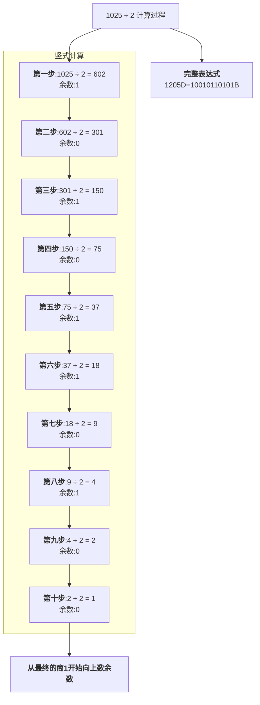
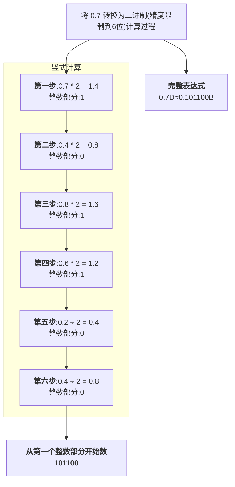

# 计算机基础

## 1 硬件

> [!todo]
> 本章节未完成

## 2 软件

### 2.1 进制

#### 2.1.1 计算机存储单位

1. 计算机的基础是0,1,一个1或0的大小是1bit

2. 常用单位

    ```mermaid
    flowchart LR
        A["Bit Binary Digit(bit)"] -->|8 bits| B["Byte(B)"]
        B -->|1024 B| C["Kilobyte(KB)"]
        C -->|1024 KB| D["Megabyte(MB)"]
        D -->|1024 MB| E["Gigabyte(GB)"]
        E -->|1024 GB| F["Terabyte(TB)"]
        
        subgraph Conversion Ratio [进制关系]
            direction LR
            G[每级单位进制:1024]
        end
    ```

3. 进制符号

    BIN二进制

    OCT八进制

    DEC十进制

    HEX十六进制

#### 2.1.2 进制转换

前进制|后进制|方法
:---|:---|:---
十进制|二进制|整数使用短除法(R)
十进制|二进制|小数部分使用乘(R)取整法
二进制|十进制|位权展开法
二进制|八进制|将3位转为1位
二进制|十六进制|4位转1位
八进制|二进制|变1位为3位
十六进制|二进制|1位转4位

#### 2.2.3 十进制转二进制-整数



#### 2.2.4 十进制转二进制-小数



#### 2.1.4 补码

1. 在Java里,int是有符号的,二进制系统是通过补码来保存数据的,最高位为1的数字用来表示负数,而最高位为0的数字表示非负数

2. 正数：原码、反码、补码 三码合一,完全一样

3. 负数：

    原码：符号位为 1,数值位与对应的正数相同

    反码：符号位不变,数值位 按位取反

    补码：反码 + 1

4. 数值 0 的表示

    原码和反码中有两种表示形式：+0 (0000 0000) 和 -0 (1000 0000 和 1111 1111)

    补码中 0 的表示是唯一的 (0000 0000),这也是现代计算机普遍采用补码的根本原因之一

5. 表示范围(对于n位二进制)

    原码和反码：-(2<sup>n-1</sup> - 1) 到 +(2<sup>n-1</sup> - 1) (例如 8 位是 -127 到 +127)

    补码：-2<sup>n-1</sup> 到 +(2<sup>n-1</sup> - 1) (例如 8 位是 -128 到 +127,多表示一个数)

6. 示例

    十进制数|原码|反码|补码
    :---:|:---:|:---:|:---:
    -7|1111 0111|1000 1000|1000 1001
    -6|1111 0110|1000 1001|1000 1010
    -5|1111 0101|1000 1010|1000 1011
    -4|1111 0100|1000 1011|1000 1100
    -3|1111 0011|1000 1100|1000 1101
    -2|1111 0010|1000 1101|1000 1110
    -1|1111 0001|1000 1110|1000 1111
    -0|1000 0000|1111 1111|0000 0000
    0|0000 0000|0000 0000|0000 0000
    1|0000 0001|0000 0001|0000 0001
    2|0000 0010|0000 0010|0000 0010
    3|0000 0011|0000 0011|0000 0011
    4|0000 0100|0000 0100|0000 0100
    5|0000 0101|0000 0101|0000 0101
    6|0000 0110|0000 0110|0000 0110
    7|0000 0111|0000 0111|0000 0111

## 3 相关文档

[<i class="fas fa-cloud"></i>阿里云-计算机基础](https://www.alipan.com/s/Uztzhj8kAXE)
